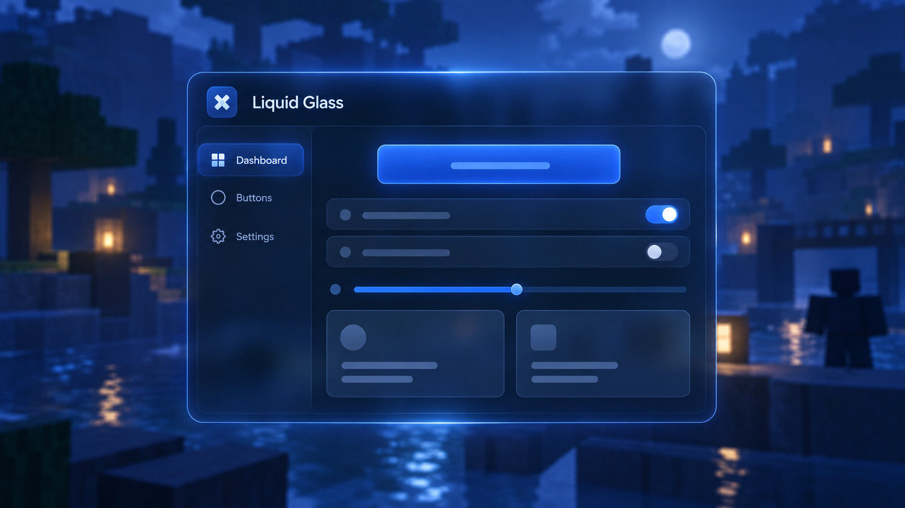
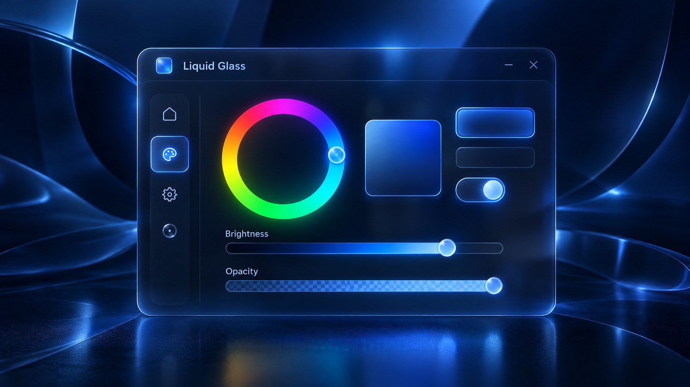

# Modern Liquid Glass

Biblioteca de interfaz cliente para Roblox, basada en la UI Liquid Glass original. Combina paneles oscuros translúcidos, blur, bordes redondeados y acentos azul neón para crear una interfaz compacta y configurable.

La ventana incluye navegación lateral, pestañas, controles interactivos y una capa de vidrio esmerilado. El aspecto predeterminado conserva la paleta y las proporciones de la UI original; el color de acento y la opacidad pueden ajustarse en ejecución.

Las imágenes son previews conceptuales del estilo y los controles; la UI funcional se construye desde el código de la biblioteca al ejecutarse.



## Características

- Ventana arrastrable, ajustable de tamaño y con animaciones de apertura y cierre.
- Pestañas originales y subpestañas para ordenar controles.
- Botones, toggles, sliders, campos de texto, dropdowns, selectors, listas y tarjetas.
- Selector cromático circular con brillo, opacidad y actualización del acento visual.
- Guardado automático de controles, idioma, tema y posición en perfiles locales JSON cuando el runtime proporciona `writefile`, `readfile` e `isfile`.
- Carga y gestión de perfiles para conservar configuraciones distintas.
- Pestaña **Language**, al final, con detección inicial del idioma de Roblox y selección entre los idiomas principales.
- Proveedores de iconos mediante glifos, IDs de assets de Roblox o resolutores propios.
- En Roblox Studio estándar, si no existen funciones de archivo local, la interfaz continúa funcionando en memoria.

## Example

Importa `src` como un `ModuleScript` llamado `ModernLiquidGlassLibrary` y ejecútalo desde un `LocalScript`:

```lua
local ReplicatedStorage = game:GetService("ReplicatedStorage")
local Library = require(ReplicatedStorage:WaitForChild("ModernLiquidGlassLibrary"))

local ui = Library.new({
    Title = "Liquid Glass",
    Subtitle = "Example",
    Language = "es",
    ConfigName = "GlassExample",
})

local main = ui:CreateTab("Example")
main:AddSection("Controles principales", "Demostración")

main:AddButton("Ejecutar acción", function()
    print("Acción ejecutada")
end)

main:AddToggle("Activar función", true, function(enabled)
    print("Activada:", enabled)
end, "example.enabled")

main:AddSlider("Intensidad", 70, function(value)
    print("Intensidad:", value)
end, "example.intensity")

main:AddDropdown("Modo", { "Equilibrado", "Rápido" }, "Equilibrado", function(mode)
    print("Modo:", mode)
end)

local appearance = main:CreateSubTab("Apariencia")
appearance:AddColorPicker("Color de acento", Color3.fromRGB(45, 145, 255), function(color)
    print("Color actualizado:", color)
end)
```
